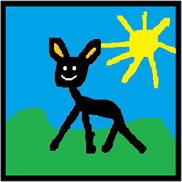

# ANPV

**A**nother **N**ameless **P**icture **V**iewer

# Features

ANPV is my attempt to write a fast, responsive and smart image viewer. The primary goal is using it to sort my image collection.

What makes this image viewer different? In short: ANPV decodes images in a smart way:

* Decoding is **not** done in the **UI thread**, therefore user input is not blocked
* Images are **decoded incrementally**, if possible (think of progressive JPEGs)
* The decoding progress is actually visualized
* Decoding of images can be *cancelled*
* **Big panorama images** are decoded and viewed in an efficient way (think of tiled-pyramide TIFFs)
* **EXIF** metadata is honored
* **Embedded thumbnails** are used to provide an instant preview of the actual full scale image, if available

I haven't found an image viewer that follows those simple design principles. Hence I decided to write my own one.

The goal is to keep the UI updated and responsive, rather than using new, fancy decoders that squeeze out every millisecond of decoding time. 

One note about TIFF files: There are so many possible subformats of TIFF, that it can be hardly tested all: Tile-based, strip-based, separate, planar, etc. TIFF files can also be multi-layered: The core assumption of ANPV is that one image file contains one and only one picture. Perhaps at different resolutions. Those artifically generated multi-layered TIFF files where each layer contains a different image are not considered to be a real world use-case. Hence, it is undefined how they will be displayed, because they are not supported. In a multi-layered TIFF file, the smallest resolution image might be used as thumbnail preview.

Also, this project is designed as **viewer**! A viewer does not support editing the images. If you want this, go for [Gwenview](https://userbase.kde.org/Gwenview) or [Gimp](https://www.gimp.org/).  If you are looking for a "viewer" with built-in converter and editor, go for [XnView](https://www.xnview.com/en/). Designing a nice and modern user interface, on the other hand, is not my strength. It is not the focus of this work either. If you want this, have a look at [photoqt](https://photoqt.org/).

# Format Support Status

| Decode feature / Supported file format | JFIF | TIFF | PNG | JXL |
|---|---|---|---|---|
| Supported compression algorithms | ✔️ JPEG | ✅ (all encodings supported by libtiff, but none of the "none-Adobe registered codecs", e.g. no JPEG XL) | ✔️ PNG | ✔️ JPEG / JPEG XL |
| EXIF Support |  ✔️ | ✅ (not for BigTIFF, due to format limitation) | ⚠️ Should work, never seen it though | ⚠️ Supported by file format, an implementation detail might be missing in ANPV |
| Region-of-interest decode support | ✔️ | ✔️ (works best for tiled-TIFFs) | ❌ (libpng API limitation) | ❌ (libjxl API limitation) |
| On-the-fly decode rescaling | ✔️ libjpeg-turbo only | ✅ Image Pyramid must be included in TIFF file | ❌ (libpng API or file format limitation) | ❌ (libjxl API limitation) |
| Multi-threaded decoding | ❌ | ❌ | ❌ | ✅ (works, might be defeated in practice due to chunked input consumption) |
| Decode cancellation support | ✔️ (almost zero-latency cancellation supported) | ✔️ (almost zero-latency cancellation supported) | ✅ (usually rather quick to respond) | ⚠️ (Some decoding phases cannot be canceled, or it may take time until cancellation occurs due to API limitation) |
| Decode progress known | ⚠️ (progress is guessed and may be inaccurate) | ✔️ (Progress works reliably) | ✔️ (Progress works reliably) | ✔️ (Progress works reliably) |

# Credits

Special thanks to Martin Pietsch, the author of the [simpleimagebrowser](https://github.com/pmfoss/simpleimagebrowser) project, for demonstrating how to customize QListView and QAbstractListModel to make them "cluster" the individual items into sections - just as we know from KDE Dolphin or KCategorizedView, but with a much simpler codebase.
